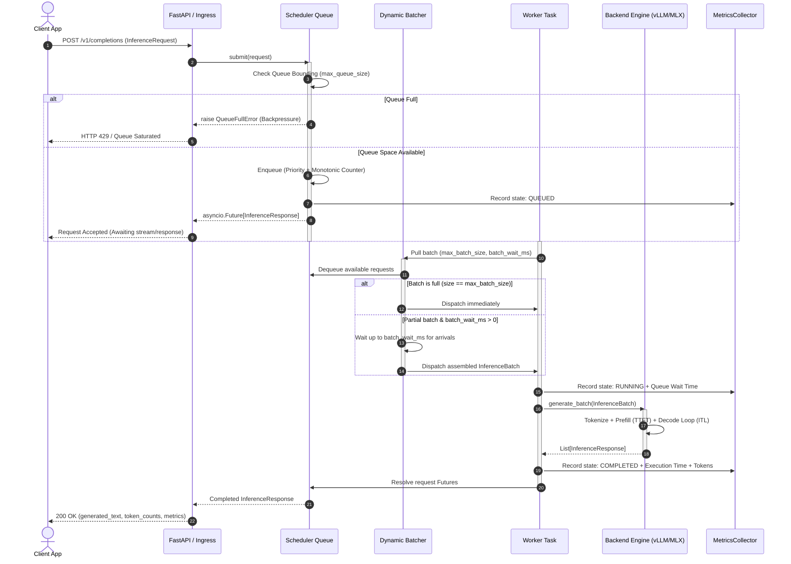
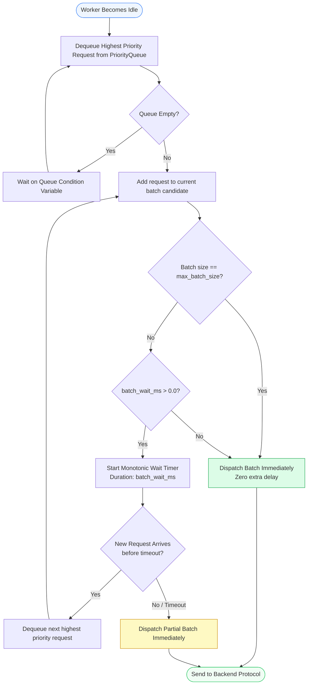

# InferOpt

<div align="center">

**Adaptive Control Plane & Scientific Validation Framework for Large Language Model Serving**

[](https://www.python.org/downloads/)
[-success.svg)](https://github.com/suyash639/InferOpt)
[](https://mypy-lang.org/)
[](https://github.com/astral-sh/ruff)
[](https://github.com/suyash639/InferOpt)

</div>

---

## Table of Contents

1. [The LLM Serving Problem](#the-llm-serving-problem)
2. [InferOpt Vision & Philosophy](#inferopt-vision--philosophy)
3. [System Architecture](#system-architecture)
4. [Detailed Serving Flows & Diagrams](#detailed-serving-flows--diagrams)
   - [Flow 1: End-to-End Request Ingestion & Lifecycle](#flow-1-end-to-end-request-ingestion--lifecycle)
   - [Flow 2: Dynamic Batching & Priority Queueing](#flow-2-dynamic-batching--priority-queueing)
   - [Flow 3: Closed-Loop SLA-Constrained Adaptive Control](#flow-3-closed-loop-sla-constrained-adaptive-control)
   - [Flow 4: Subprocess Engine Lifecycle & Hardware Isolation](#flow-4-subprocess-engine-lifecycle--hardware-isolation)
5. [Core Subsystems Deep Dive](#core-subsystems-deep-dive)
   - [Asynchronous Priority Scheduler](#1-asynchronous-priority-scheduler)
   - [Dynamic Batching Engine](#2-dynamic-batching-engine)
   - [High-Resolution In-Process Telemetry](#3-high-resolution-in-process-telemetry)
   - [Deterministic Optimization Engine](#4-deterministic-optimization-engine)
   - [SLA-Constrained Adaptive Controller](#5-sla-constrained-adaptive-controller)
   - [Pluggable Backend Abstraction](#6-pluggable-backend-abstraction)
6. [Milestone Evolution: Step-by-Step Chronology (Steps 1 – 17)](#milestone-evolution-step-by-step-chronology-steps-1--17)
7. [Scientific Validation & The 20-Rule Verification Gate](#scientific-validation--the-20-rule-verification-gate)
8. [Installation & Quick Start](#installation--quick-start)
9. [CLI Benchmark & Validation Suite](#cli-benchmark--validation-suite)
10. [Repository Structure & Development Standards](#repository-structure--development-standards)

---

## The LLM Serving Problem

Serving Large Language Models (LLMs) in production environments differs fundamentally from conventional microservices and stateless deep learning inference:

```text
+-----------------------------------------------------------------------------------------+
|                               Why LLM Serving is Hard                                   |
+-----------------------------------------------------------------------------------------+
|  1. Asymmetric Phases   | Prefill is compute-bound (O(N^2) attention over prompt).      |
|                         | Decode is memory-bandwidth bound (O(1) token generated).      |
|-------------------------+---------------------------------------------------------------|
|  2. KV Cache Pressure   | Key-Value memory grows dynamically per token per layer,        |
|                         | leading to fragmentation, thrashing, and out-of-memory crashes.|
|-------------------------+---------------------------------------------------------------|
|  3. Variable Sequences  | Requests have widely divergent prompt & generation lengths.   |
|                         | Static batching leads to severe head-of-line blocking.        |
|-------------------------+---------------------------------------------------------------|
|  4. Conflicting Metrics | High token throughput (TPS) directly degrades interactive     |
|                         | Time-To-First-Token (TTFT) and Inter-Token Latency (ITL).     |
|-------------------------+---------------------------------------------------------------|
|  5. Saturation Knee     | Beyond hardware memory bandwidth saturation, adding batch size|
|                         | produces zero TPS gains while tail latency explodes.          |
+-----------------------------------------------------------------------------------------+
```

Raw inference engines (such as [vLLM](https://github.com/vllm-project/vllm) or [MLX](https://github.com/ml-explore/mlx)) provide low-level kernel execution, PagedAttention, and model weights management, but they lack a **global, telemetry-driven control plane** to orchestrate multi-tenant priorities, dynamic batch wait windows, bounded queue backpressure, online configuration adaptation, and strict SLA guardrailing.

---

## InferOpt Vision & Philosophy

InferOpt operates as a decoupled **intelligent control plane and optimization layer** positioned directly above raw execution engines:

```text
                      +-----------------------------+
                      |     Client Applications     |
                      +--------------+--------------+
                                     |
                                     v
                      +-----------------------------+
                      |    InferOpt Control Plane   |  <-- Policy, Queueing,
                      |  (Scheduler, SLA, Telemetry)|      Dynamic Batching,
                      +--------------+--------------+      Adaptation
                                     |
                                     v
                      +-----------------------------+
                      |    Raw Execution Engines    |  <-- PagedAttention,
                      |   (vLLM, MLX, TensorRT-LLM) |      CUDA Kernels, Weights
                      +-----------------------------+
```

### Core Tenets

1. **Strict Decoupling**: High-level serving policies (admission, priority, batch formation, SLA enforcement) are completely decoupled from low-level tensor operations and GPU kernels.
2. **Deterministic & Explainable Optimization**: No opaque "black-box" models controlling runtime behavior. All adaptation decisions are derived from deterministic Pareto evaluation, monotonic criteria, and explainable safety guardrails.
3. **Scientific Ground Truth**: Performance claims must be backed by reproducible empirical evidence on physical hardware (Metal GPU on Apple Silicon, CUDA GPU on NVIDIA Tesla/A100/H100) using strict multi-trial isolation, deterministic workload hashing, and isolated subprocess lifecycle management.
4. **Zero Overhead on Idle**: Lightweight, zero-dependency async scheduling ensuring sub-millisecond control-plane overhead.

---

## System Architecture

The following diagram illustrates the complete InferOpt architecture, showing the separation between the API ingress, control plane, telemetry feedback loops, optimizer, and backend execution layers:

```mermaid
flowchart TB
    subgraph ClientLayer["Client Layer"]
        Client["Client / Application\n(HTTP / gRPC / SDK)"]
    end

    subgraph APILayer["API Ingress Layer"]
        FastAPIApp["FastAPI Ingestion\n(/v1/completions, /health, /metrics)"]
    end

    subgraph ControlPlane["InferOpt Control Plane"]
        Scheduler["Asynchronous Priority Scheduler\n(inferopt.scheduler.Scheduler)"]
        PriorityQueue["Bounded Priority Queue\n(Priority + Monotonic FIFO)"]
        DynamicBatcher["Dynamic Batching Subsystem\n(max_batch_size, batch_wait_ms)"]
        WorkerPool["Bounded Async Worker Pool\n(max_concurrency)"]
    end

    subgraph TelemetrySubsystem["Telemetry & Observability"]
        Collector["MetricsCollector\n(Nanosecond High-Resolution Timers)"]
        Snapshots["MetricsSnapshot\n(p50, p90, p95, p99, TTFT, ITL, TPS)"]
    end

    subgraph OptimizationSubsystem["Optimization & Closed-Loop Control"]
        Optimizer["DeterministicOptimizer\n(Pareto Search Space Explorer)"]
        RegimeDetector["Traffic Regime Detector\n(LIGHT, BURSTY, SATURATED, MIXED)"]
        SLAController["SLA-Constrained Adaptive Controller\n(Min-Dwell Damping & Automated Rollback)"]
    end

    subgraph BackendLayer["Backend Abstraction Layer (Protocols)"]
        Protocol["<<InferenceBackendProtocol>>\n<<BatchInferenceBackendProtocol>>"]
        Mock["MockBackend\n(GPU-free Simulation & CI)"]
        MLX["MLXBackend\n(Apple Silicon Metal Unified Memory)"]
        VLLM["VLLMBackend\n(NVIDIA CUDA / PagedAttention)"]
    end

    Client -->|InferenceRequest| FastAPIApp
    FastAPIApp -->|submit()| Scheduler
    Scheduler --> PriorityQueue
    PriorityQueue --> DynamicBatcher
    DynamicBatcher --> WorkerPool
    WorkerPool -->|InferenceBatch| Protocol
    Protocol --> Mock
    Protocol --> MLX
    Protocol --> VLLM

    WorkerPool -.->|Lifecycle Timings| Collector
    Collector --> Snapshots
    Snapshots --> RegimeDetector
    Snapshots --> SLAController
    RegimeDetector --> SLAController
    Optimizer -.->|Candidate Ladder| SLAController
    SLAController -->|apply_config()| Scheduler

    style ClientLayer fill:#f9f9fb,stroke:#6b7280,stroke-width:1px
    style APILayer fill:#eff6ff,stroke:#3b82f6,stroke-width:1px
    style ControlPlane fill:#f0fdf4,stroke:#22c55e,stroke-width:1px
    style TelemetrySubsystem fill:#fefce8,stroke:#eab308,stroke-width:1px
    style OptimizationSubsystem fill:#faf5ff,stroke:#a855f7,stroke-width:1px
    style BackendLayer fill:#fff1f2,stroke:#f43f5e,stroke-width:1px
```

---

## Detailed Serving Flows & Diagrams

### Flow 1: End-to-End Request Ingestion & Lifecycle

This sequence diagram depicts the journey of an inference request from client submission through priority queueing, dynamic batching, hardware execution, telemetry recording, and final response resolution:



---

### Flow 2: Dynamic Batching & Priority Queueing

InferOpt uses an intelligent batch formation algorithm that maximizes hardware saturation while bounding queuing delay:



---

### Flow 3: Closed-Loop SLA-Constrained Adaptive Control

InferOpt continuously monitors empirical performance through rolling telemetry windows and dynamically adapts scheduler parameters without restarting the process or dropping requests:

```mermaid
flowchart TD
    subgraph Monitoring["1. Telemetry Aggregation"]
        RawMetrics[Raw Request & Batch Metrics] --> Collector[MetricsCollector]
        Collector --> Snapshot[MetricsSnapshot Window\np50, p95, throughput, queue_depth]
    end

    subgraph Decision["2. Adaptive Decision Engine"]
        Snapshot --> Gate1{Data Sufficiency Gate\nmin_requests & min_batches met?}
        Gate1 -- No --> Hold1[Emit Decision: INSUFFICIENT_DATA\nKeep current configuration]
        Gate1 -- Yes --> Gate2{Cooldown / Dwell Gate\nmin_dwell_windows elapsed?}
        Gate2 -- No --> Hold2[Emit Decision: COOLDOWN\nPrevent thrashing/oscillation]
        Gate2 -- Yes --> SLACheck{SLA Violation?\nmeasured p95 > SLA threshold}

        SLACheck -- Yes --> RollbackCheck{Prior Safe Config\nAvailable?}
        RollbackCheck -- Yes --> Rollback[Emit Decision: ROLLBACK\nRevert to known safe configuration]
        RollbackCheck -- No --> Downscale[Select More Conservative Pareto Point\ne.g., lower concurrency / smaller batch]

        SLACheck -- No --> RegimeEval[Detect Traffic Regime\nLIGHT, BURSTY, SATURATED, MIXED]
        RegimeEval --> ParetoRank[Evaluate Candidate Space via DeterministicOptimizer\nMaximize TPS subject to Latency SLA]
        ParetoRank --> HysteresisGate{Improvement > min_improvement_pct?}
        HysteresisGate -- No --> Hold3[Emit Decision: NO_CHANGE\nFluctuation within noise floor]
        HysteresisGate -- Yes --> ApplyNew[Emit Decision: APPLY\nNew Config: (concurrency, batch_size, wait_ms)]
    end

    subgraph Execution["3. Live Scheduler Reconfiguration"]
        ApplyNew --> AtomicUpdate[Scheduler.apply_config\n1. Replace config atomically\n2. Scale worker pool dynamically\n3. Preserve all queued & in-flight requests]
        Rollback --> AtomicUpdate
        Downscale --> AtomicUpdate
    end

    style Monitoring fill:#f8fafc,stroke:#64748b
    style Decision fill:#faf5ff,stroke:#a855f7
    style Execution fill:#f0fdf4,stroke:#22c55e
```

---

### Flow 4: Subprocess Engine Lifecycle & Hardware Isolation

To ensure 100% scientific validity and prevent CUDA/Metal memory leaks between benchmark trials, InferOpt uses an isolated subprocess execution architecture:

```mermaid
flowchart TD
    subgraph ParentRunner["Parent Process (Benchmark Orchestrator)"]
        WorkloadGen[Generate Workload Scenario] --> HashWorkload[Compute Workload SHA-256 Hash]
        HashWorkload --> PlanMatrix[Build Experimental Grid Matrix\ne.g. Concurrency x Batch Size]
        PlanMatrix --> LoopConditions[For each experimental condition...]
    end

    subgraph ProcessBoundary["Process Isolation Barrier (multiprocessing)"]
        LoopConditions --> SpawnChild[Spawn Isolated Subprocess\nFork / Spawn with clean memory]
    end

    subgraph ChildProcess["Isolated Subprocess (Single Experimental Trial)"]
        SpawnChild --> InitEngine[Initialize Backend Engine\nvLLM / MLX / Mock]
        InitEngine --> RunWarmup[Execute N Warmup Iterations\nDiscard warmup outputs & timings]
        RunWarmup --> ReplayWorkload[Replay SHA-256 Workload Exact Sequence]
        ReplayWorkload --> RecordTimers[Record High-Resolution Timers & Tokens]
        RecordTimers --> TeardownEngine[Explicit Engine Teardown\nengine.teardown() + CUDA cache purge]
        TeardownEngine --> ReturnMetrics[Serialize Metrics & Hardware Confirmation]
    end

    subgraph Aggregation["Parent Result Reconciliation & Verification"]
        ReturnMetrics --> IPCPipe[Transfer JSON via Pipe / Temp File]
        IPCPipe --> VerifyGate{20-Predicate Verification Gate\n- Workload hash match\n- Exactly 1 init & teardown\n- Hardware engine verified\n- Zero dropped requests}
        VerifyGate -- Pass --> AggregateResults[Compute Mean, Median, p95, TPS, StdDev]
        VerifyGate -- Fail --> AbortInvalid[Mark Run Invalid & Report Diagnostic]
    end

    style ParentRunner fill:#eff6ff,stroke:#3b82f6
    style ProcessBoundary fill:#fef2f2,stroke:#ef4444,stroke-dasharray: 5 5
    style ChildProcess fill:#f0fdf4,stroke:#22c55e
    style Aggregation fill:#faf5ff,stroke:#a855f7
```

---

## Core Subsystems Deep Dive

### 1. Asynchronous Priority Scheduler

Located in [`src/inferopt/scheduler/`](file:///Users/suyashtiwari/Documents/Inferopt/src/inferopt/scheduler/), the `Scheduler` coordinates all request traffic.

- **Priority Queueing with Monotonic FIFO**:
  Requests are stored in an internal priority heap sorted by a 2-tuple:
  $$\text{Queue Key} = (\text{priority.value}, \text{arrival\_monotonic\_counter})$$
  Higher numerical priority values are dequeued first. Within identical priority tiers, requests are strictly dispatched in first-in-first-out (FIFO) order using a monotonically increasing sequence counter, preventing starvation and head-of-line anomalies.
- **Bounded Queue & Backpressure**:
  When pending requests reach `max_queue_size`, subsequent submissions are immediately rejected with a `QueueFullError`, protecting backend runtimes from unbounded memory exhaustion.
- **Dynamic Worker Scaling (`apply_config`)**:
  When concurrency parameters change at runtime, the scheduler scales its worker pool dynamically:
  - *Scale Up*: Spawns additional async worker tasks immediately.
  - *Scale Down*: Flags excess workers to retire cleanly after finishing their active batch.
  - *Queue Preservation*: All queued requests remain ordered and untouched.

---

### 2. Dynamic Batching Engine

InferOpt groups queued requests into `InferenceBatch` instances based on `BatchConfig`:

$$\text{Batch Parameters} = (\text{max\_batch\_size}, \text{batch\_wait\_ms})$$

1. **Immediate Full-Batch Dispatch**: If the queue contains $\ge \text{max\_batch\_size}$ requests, the batch is formed and dispatched immediately with **zero delay**.
2. **Monotonic Wait Window**: If fewer requests are available, workers start a monotonic timer up to `batch_wait_ms`. If new requests arrive and fill the batch before expiration, the batch dispatches immediately.
3. **Partial Batch Dispatch on Timeout**: If the wait window expires before capacity is reached, the partial batch dispatches immediately without stalling callers.

---

### 3. High-Resolution In-Process Telemetry

Located in [`src/inferopt/telemetry/`](file:///Users/suyashtiwari/Documents/Inferopt/src/inferopt/telemetry/), the telemetry layer measures every phase of the inference lifecycle using nanosecond-precision monotonic clocks (`time.perf_counter()`):

```text
Request Submission
   │
   ├─► Queue Wait Time (queue_wait_ms)
   │
Batch Dispatched
   │
   ├─► Time-To-First-Token (TTFT)  [Prefill Phase]
   │
First Token Emitted
   │
   ├─► Inter-Token Latency (ITL)   [Autoregressive Decode Phase]
   │
Final Token Emitted
   │
   └─► Total Turnaround Latency (total_latency_ms)
```

- **Percentile Tracking**: Computes exact $p50$, $p90$, $p95$, and $p99$ tail latency percentiles across sliding windows.
- **Throughput Accounting**: Tracks processed requests/sec, prompt tokens/sec, output tokens/sec, and total tokens/sec.
- **Queue Diagnostics**: Measures active in-flight concurrency, real-time queue depth, and peak queue depth.

---

### 4. Deterministic Optimization Engine

Located in [`src/inferopt/optimizer/`](file:///Users/suyashtiwari/Documents/Inferopt/src/inferopt/optimizer/), the `DeterministicOptimizer` evaluates configurations across a Cartesian candidate space:

$$\text{Candidate Space} = \mathcal{C} \times \mathcal{B} \times \mathcal{W} = \{\text{concurrency}\} \times \{\text{batch\_size}\} \times \{\text{batch\_wait\_ms}\}$$

#### Objective Formulations (`ObjectiveConfig`)

1. **`THROUGHPUT`**:
   $$\text{Score} = \text{throughput\_rps}$$
2. **`LATENCY`**:
   $$\text{Score} = -\text{p95\_latency\_ms}$$
3. **`BALANCED`**:
   $$\text{Score} = w_{\text{tput}} \cdot \left(\frac{\text{throughput\_rps}}{\text{target\_throughput}}\right) - w_{\text{lat}} \cdot \left(\frac{\text{p95\_latency\_ms}}{\text{target\_p95\_latency}}\right)$$
   where $w_{\text{tput}} + w_{\text{lat}} = 1.0$.

#### Deterministic 5-Tier Tie-Breaking Comparator
When two candidate configurations achieve identical objective scores, ties are resolved deterministically using a fixed lexicographical hierarchy:
1. **Objective Score** ($\uparrow$ higher is better)
2. **$p95$ Tail Latency** ($\downarrow$ lower is better)
3. **`batch_wait_ms`** ($\downarrow$ smaller wait window is better)
4. **`max_batch_size`** ($\downarrow$ smaller memory footprint is better)
5. **`max_concurrency`** ($\downarrow$ lower resource footprint is better)

---

### 5. SLA-Constrained Adaptive Controller

Located in [`src/inferopt/optimizer/sla_controller.py`](file:///Users/suyashtiwari/Documents/Inferopt/src/inferopt/optimizer/sla_controller.py), the `SLAAdaptiveController` provides safe, closed-loop runtime control:

- **Pareto Candidate Ladder**: Ranks all verified feasible configurations along the Pareto efficiency frontier.
- **Min-Dwell Hysteresis**: Requires the system to remain in a given configuration for a minimum number of evaluation windows (`min_dwell_windows`) before permitting another transition, eliminating oscillation and control thrashing.
- **Automated Rollback**: If an applied configuration violates an SLA target ($\text{p95} > \text{SLA}$) or degrades performance by more than $\text{rollback\_degradation\_pct}$, the controller immediately reverts to the prior known-safe configuration.

---

### 6. Pluggable Backend Abstraction

InferOpt defines clean async protocols in [`src/inferopt/backends/base.py`](file:///Users/suyashtiwari/Documents/Inferopt/src/inferopt/backends/base.py):

| Backend | Target Hardware | Execution Engine | Use Case |
| :--- | :--- | :--- | :--- |
| **`MockBackend`** | CPU (Any OS) | Async Sleep & Synthetic Tokenizer | Unit testing, CI/CD pipelines, control-plane simulation |
| **`MLXBackend`** | Apple Silicon (macOS) | Apple MLX (`mlx-lm`, Metal unified memory) | Local LLM testing, workstation development, Metal GPU validation |
| **`VLLMBackend`** | Linux + NVIDIA CUDA | vLLM (`vllm.LLM`, PagedAttention, Triton) | Production cluster serving, high-throughput GPU benchmarking |

---

## Milestone Evolution: Step-by-Step Chronology (Steps 1 – 17)

InferOpt has been developed through a disciplined, milestone-driven scientific process. Each step builds upon verified foundations:

| Step | Milestone Name | Key Technical Additions | Validation Focus |
| :---: | :--- | :--- | :--- |
| **1** | **Core Domain Models & Protocols** | `InferenceRequest`, `InferenceResponse`, `RequestPriority`, `InferenceBackendProtocol` | Immutable domain structures, type safety |
| **2** | **Asynchronous Scheduler** | Bounded priority queue, monotonic FIFO tie-breaker, worker lifecycle | Queue bounding, backpressure (`QueueFullError`) |
| **3** | **Dynamic Batching Engine** | `BatchConfig`, `InferenceBatch`, wait windows, timeout dispatch | Immediate vs wait-window batch formation |
| **4** | **In-Process Telemetry Foundation** | `MetricsCollector`, `RequestMetrics`, `MetricsSnapshot`, $p50/p90/p95/p99$ | Nanosecond timers, TTFT, ITL, token throughput |
| **5** | **Synthetic Workload Generator** | `WorkloadScenario`, `ArrivalPattern` (Sequential, Concurrent, Burst, Rate) | Deterministic seeds, reproducible CLI harness |
| **6** | **Deterministic Optimizer** | `DeterministicOptimizer`, `CandidateSpace`, Pareto objective scoring | Multi-criteria scoring, lexicographical tie-breaking |
| **7** | **Closed-Loop Adaptive Controller** | `AdaptiveController`, dynamic live `apply_config()`, anti-thrashing cooldown | Bounded adaptation, automated safety rollback |
| **8** | **Apple Silicon MLX Backend** | `MLXBackend`, Metal unified memory, native `mlx_lm.batch_generate` | Local hardware execution, exact tokenizer counts |
| **8.5** | **Controlled Apple Silicon Baseline** | `DirectMLXRunner` vs `BenchmarkRunner` under identical workloads | Controlled differential overhead on Metal GPU |
| **9** | **NVIDIA vLLM Backend Integration** | `VLLMBackend`, PagedAttention, native batched `LLM.generate` | High-throughput CUDA GPU serving abstraction |
| **10** | **Scientific Real-vLLM Validation** | 5-condition GPU benchmark (Direct vs Batch 1, 2, 4, 8) | Workload SHA-256 hash replay, cold-start isolation |
| **11** | **Workload-Aware Batch Selection** | Empirical grid search $(c, b, w)$ matched to arrival distributions | Workload-dependent optimal configuration mapping |
| **12** | **Multi-Workload Generalization** | Evaluation across Light, Bursty, Saturated, Mixed traffic profiles | Generalization across heterogeneous traffic patterns |
| **13** | **Dynamic Workload Transitions** | Live workload shifting (Light $\to$ Burst $\to$ Saturated) with zero restart | Seamless runtime adaptation under shifting load |
| **14** | **SLA-Constrained Adaptive Control** | `SLAAdaptiveController`, Pareto candidate ladder, min-dwell damping | Strict p95 tail latency enforcement under load |
| **15** | **Multi-Model Architecture Generalization** | SmolLM2-1.7B, Qwen2.5-0.5B, Llama-3.2-1B evaluation | Model-invariant scheduling & batching efficiency |
| **16** | **Heavy-Load Scalability & Saturation** | Concurrency scaling $N \in \{16, 32, 64, 128, 256\}$, 20-rule audit | Hardware saturation knee, memory bandwidth limits |
| **17** | **Long-Context & Production Traffic** | Contexts Short (64) to XLong (2048), Production traffic patterns | KV cache memory pressure, prefill/decode balance |

---

## Scientific Validation & The 20-Rule Verification Gate

To prevent benchmarking artifacts, measurement noise, and cherry-picking, InferOpt enforces a **20-predicate verification architecture** across all hardware benchmark runs:

```text
+----------------------------------------------------------------------------------------------------+
|                                 The 20-Rule Scientific Verification Gate                           |
+----------------------------------------------------------------------------------------------------+
|  1. Deterministic Workload Hash  | Exact SHA-256 matching across all comparative experimental arms. |
|  2. Isolated Subprocess          | Clean process spawn per condition; no state leak across runs.   |
|  3. Warmup Isolation             | Warmup requests explicitly executed & discarded before timing.  |
|  4. Hardware Engine Verified     | Physical execution confirmed on GPU/Metal (no mock backends).   |
|  5. Exact Lifecycle Invariant    | Exactly 1 engine initialization and exactly 1 engine teardown.  |
|  6. Zero Dropped Requests        | 100% request completion; zero failed or missing requests.        |
|  7. 1:1 ID Preservation          | Output IDs match input request IDs in exact order.              |
|  8. Non-Empty Outputs            | All generated responses contain valid, non-empty text.           |
|  9. Non-Negative Token Counts    | Real prompt and generated tokens measured via exact tokenizer.  |
| 10. Monotonic Time Invariant     | Total latency >= queue_wait + execution_time.                   |
| 11. Multi-Trial Aggregation      | Multiple repetitions (>=3) reporting mean, median, min, max, std.|
| 12. Non-Cherry-Picked Reporting  | Outliers preserved; sample standard deviation reported.         |
| 13. Differential Overhead Metric | Formally quantified control-plane delta relative to direct baseline.|
| 14. Saturation Knee Detection    | Distinguishes saturation plateaus from true scaling peaks.       |
| 15. Real Memory Tracking         | Engine teardown cleans and frees CUDA / Metal allocations.      |
| 16. Reproducible Random Seeds    | Deterministic random seeds across all generation procedures.     |
| 17. Safe Eager Mode Flagging     | Diagnostic flags (--enforce-eager) explicitly reported.         |
| 18. SLA Guardrail Compliance     | Automated verification of p95 latency bounds against targets.   |
| 19. Atomic Reconfiguration Safety| Dynamic config updates preserve 100% of pending queue items.     |
| 20. JSON Evidence Persistence    | Machine-readable raw artifacts saved for independent audit.      |
+----------------------------------------------------------------------------------------------------+
```

---

## Installation & Quick Start

### 1. Installation

InferOpt is packaged with optional extras for different hardware environments:

```bash
# Clone repository
git clone https://github.com/suyash639/InferOpt.git
cd InferOpt

# Option A: Core installation (Mock backend, CPU CI, local unit tests)
pip install -e .

# Option B: Apple Silicon MLX installation (macOS Metal GPU)
pip install -e ".[mlx]"

# Option C: NVIDIA GPU vLLM installation (Linux + CUDA)
pip install -e ".[vllm]"

# Option D: Development installation (Linting, type checking, pytest)
pip install -e ".[dev]"
```

### 2. Quick Start: Python API

```python
import asyncio
from inferopt.backends.mock import MockBackend
from inferopt.core.models import InferenceRequest, RequestPriority
from inferopt.scheduler.config import BatchConfig, SchedulerConfig
from inferopt.scheduler.scheduler import Scheduler


async def main() -> None:
    # 1. Initialize backend and scheduler
    backend = MockBackend(base_latency_ms=10.0)
    config = SchedulerConfig(
        max_concurrency=4,
        max_queue_size=100,
        batch_config=BatchConfig(max_batch_size=4, batch_wait_ms=10.0),
    )

    async with Scheduler(config=config, backend=backend) as scheduler:
        # 2. Submit requests with heterogeneous priorities
        req1 = InferenceRequest(
            prompt="Explain KV cache memory management in LLMs.",
            max_tokens=64,
            priority=RequestPriority.HIGH,
        )
        req2 = InferenceRequest(
            prompt="What is dynamic batching?",
            max_tokens=32,
            priority=RequestPriority.NORMAL,
        )

        # 3. Await asynchronous resolution
        resp1, resp2 = await asyncio.gather(
            scheduler.submit(req1),
            scheduler.submit(req2),
        )

        print(f"Response 1: {resp1.text}")
        print(f"Response 2: {resp2.text}")

        # 4. Inspect real-time telemetry snapshot
        snapshot = scheduler.collector.snapshot()
        print(f"Total Completed: {snapshot.requests.completed_count}")
        print(f"Mean Latency: {snapshot.requests.mean_latency_ms:.2f} ms")
        print(f"Total Tokens/Sec: {snapshot.throughput.total_tokens_per_sec:.2f}")


if __name__ == "__main__":
    asyncio.run(main())
```

---

## CLI Benchmark & Validation Suite

InferOpt includes a rich CLI for reproducible benchmarking and scientific validation:

```bash
# ==============================================================================
# 1. Synthetic Workload Benchmark (Step 5)
# ==============================================================================
python -m inferopt.benchmarks --scenario light --backend mock
python -m inferopt.benchmarks --scenario burst --num-requests 100 --backend mock

# ==============================================================================
# 2. Apple Silicon MLX Controlled Validation (Step 8.5)
# ==============================================================================
# Single request controlled baseline comparison
python -m inferopt.benchmarks --validate-mlx --scenario single --warmup 1 --repetitions 3

# Full batching matrix on Metal GPU (4, 8, 16 concurrency x 1, 2, 4, 8 batch size)
python -m inferopt.benchmarks --validate-mlx --batch-matrix

# ==============================================================================
# 3. NVIDIA GPU vLLM Scientific Validation (Step 10)
# ==============================================================================
# 5-condition GPU benchmark (Direct vLLM vs InferOpt Batch 1, 2, 4, 8)
python -m inferopt.benchmarks.cli --validate-vllm \
    --concurrency 1 4 8 16 \
    --batch-sizes 1 2 4 8 \
    --repetitions 3 \
    --warmup 2

# ==============================================================================
# 4. Dynamic Workload Transitions (Step 13)
# ==============================================================================
python -m inferopt.benchmarks.cli --step13-transitions --backend mock

# ==============================================================================
# 5. SLA-Constrained Adaptive Control (Step 14)
# ==============================================================================
python -m inferopt.benchmarks.cli --step14-sla-adaptive --sla-p95 50.0 --backend mock

# ==============================================================================
# 6. Heavy-Load Scalability & Saturation (Step 16)
# ==============================================================================
python -m inferopt.benchmarks.cli --step16-scalability \
    --concurrency-levels 16 32 64 128 256 \
    --model HuggingFaceTB/SmolLM2-1.7B-Instruct

# ==============================================================================
# 7. Long-Context & Production-Like Traffic (Step 17)
# ==============================================================================
python -m inferopt.benchmarks.cli --step17-long-context \
    --traffic-patterns STEADY BURSTY MIXED LONG_CONTEXT_BURST \
    --context-lengths SHORT MEDIUM LONG XLONG
```

---

## Repository Structure & Development Standards

```text
InferOpt/
├── src/inferopt/
│   ├── api/                    # FastAPI endpoints & request schemas
│   ├── backends/               # Pluggable backend execution runtimes
│   │   ├── base.py             # InferenceBackend & BatchInferenceBackend protocols
│   │   ├── mock.py             # Deterministic GPU-free simulation backend
│   │   ├── mlx.py              # Apple Silicon Metal GPU runtime
│   │   └── vllm.py             # NVIDIA CUDA GPU vLLM runtime
│   ├── benchmarks/             # Scientific benchmark suite & validation runners
│   │   ├── cli.py              # Unified CLI benchmark entrypoint
│   │   ├── generator.py        # Deterministic workload generation & hashing
│   │   ├── mlx_validation.py   # Step 8.5 Apple Silicon validation harness
│   │   ├── vllm_validation.py  # Step 10 NVIDIA vLLM validation harness
│   │   ├── step11_*.py         # Workload-aware batch selection experiments
│   │   ├── step12_*.py         # Multi-workload generalization experiments
│   │   ├── step13_*.py         # Online dynamic reconfiguration experiments
│   │   ├── step14_*.py         # SLA-constrained adaptive control experiments
│   │   ├── step15_*.py         # Multi-model generalization experiments
│   │   ├── step16_*.py         # Heavy-load scalability & saturation validation
│   │   └── step17_*.py         # Long-context & production traffic validation
│   ├── core/                   # Core domain models, enums, exceptions
│   ├── optimizer/              # Deterministic Pareto optimizer & SLA controller
│   ├── router/                 # Request routing & multi-instance load balancing
│   ├── scheduler/              # Asynchronous priority scheduler & dynamic batcher
│   └── telemetry/              # High-resolution timers, metrics collector & snapshots
├── tests/
│   ├── unit/                   # Comprehensive unit tests (369 tests, 100% passing)
│   └── integration/            # Multi-backend end-to-end integration tests
├── scripts/                    # Standalone utility & experiment runners
├── pyproject.toml              # Build config, dependencies, extras, and tool settings
└── README.md                   # System documentation and architectural diagrams
```

### Quality Assurance & Verification Commands

InferOpt adheres to strict software engineering standards:

```bash
# Run complete unit and integration test suite
uv run pytest -q

# Run strict type checking (0 errors across codebase)
uv run mypy src --strict

# Run code style and lint checks
uv run ruff check .
uv run ruff format --check .
```

---

<div align="center">

**InferOpt is engineered with mathematical precision, architectural discipline, and zero unverified performance claims.**

</div>
